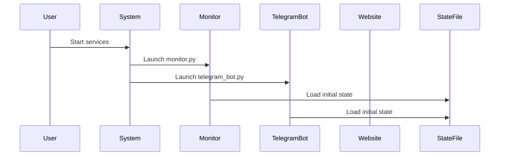
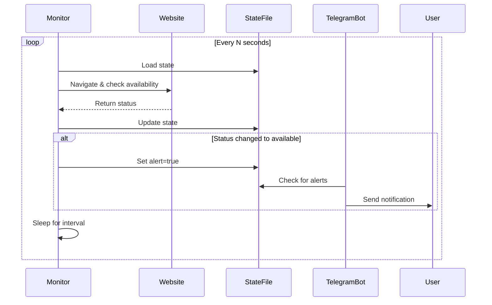
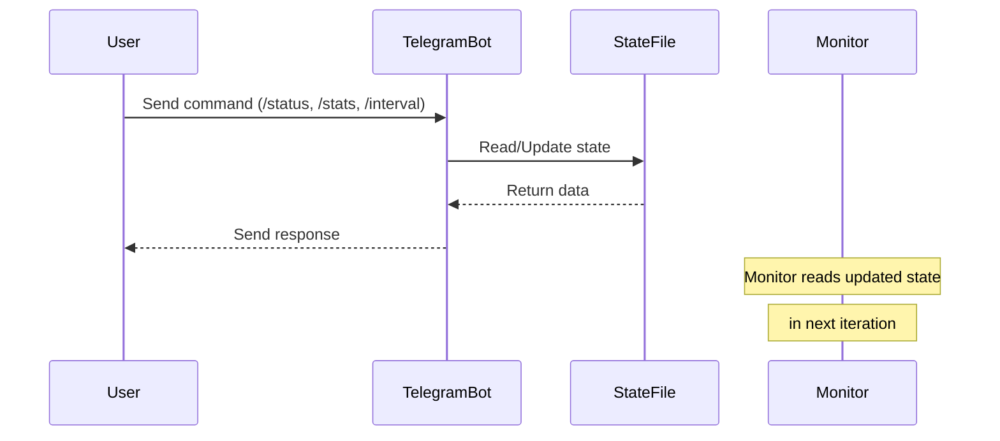

# Parking Monitor System Documentation

## Table of Contents
1. [Executive Summary](#executive-summary)
2. [System Overview](#system-overview)
3. [Architecture](#architecture)
4. [Components](#components)
5. [Data Models](#data-models)
6. [System Workflow](#system-workflow)
7. [Setup and Configuration](#setup-and-configuration)
8. [Development Guide](#development-guide)
9. [Deployment](#deployment)
10. [Troubleshooting](#troubleshooting)
11. [API Reference](#api-reference)
12. [Appendices](#appendices)

---

## Executive Summary

The Parking Monitor System is an automated monitoring solution designed to check parking availability on the Moscow parking website (parking.mos.ru). The system continuously monitors a specific parking location and sends notifications via Telegram when parking spaces become available. It consists of two main services that run independently: a web scraper service that checks parking availability and a Telegram bot service that provides user interface and notifications.

**Key Features:**
- Automated periodic monitoring of parking availability
- Real-time Telegram notifications when parking becomes available
- Remote configuration via Telegram bot commands
- Persistent state tracking with statistics
- Service-based architecture suitable for 24/7 operation
- Simple deployment with minimal dependencies

**Technical Stack:**
- Python 3.7+ with asyncio support
- Playwright for web automation and scraping
- python-telegram-bot for Telegram integration
- JSON file-based state persistence
- systemd for service management (production)

---

## System Overview

### Purpose
The Parking Monitor System solves the problem of monitoring parking availability in high-demand areas. Instead of manually checking the parking website, users receive automated notifications when their desired parking spot becomes available for subscription.

### Business Logic
The system monitors a specific parking location defined by region and address:
- **Target Region**: Западный административный округ (Western Administrative District)
- **Target Address**: улица Поклонная, дом 11А (Poklonnaya Street, 11A)

The monitoring process involves:
1. Navigating to the parking subscription page
2. Selecting the appropriate region and address
3. Checking if the address is enabled for subscription
4. Tracking state changes to detect when parking becomes available

### Key Benefits
- **Time-saving**: Eliminates need for manual website monitoring
- **Real-time alerts**: Immediate notifications when parking becomes available
- **Reliability**: Continuous monitoring with error handling
- **Flexibility**: Remote configuration without code changes
- **Statistics**: Track monitoring history and success rates

---

## Architecture

### High-Level Architecture
```
┌─────────────────┐     ┌─────────────────┐     ┌─────────────────┐
│   parking.mos   │     │   Monitor.py    │     │ State.json      │
│     .ru         │────▶│   (Service)     │◀────│   (Storage)     │
│                 │     │                 │     │                 │
└─────────────────┘     └─────────────────┘     └─────────────────┘
                                │
                                │ alerts
                                ▼
                       ┌─────────────────┐     ┌─────────────────┐
                       │ telegram_bot.py │     │   Telegram      │
                       │   (Service)     │◀────│     API         │
                       │                 │────▶│                 │
                       └─────────────────┘     └─────────────────┘
                                ▲
                                │ commands
                                │
                       ┌─────────────────┐
                       │   User          │
                       │                 │
                       └─────────────────┘
```

### Service Architecture
The system uses a dual-service architecture:

1. **Monitor Service (monitor.py)**
   - Runs as a continuous background process
   - Executes periodic checks at configurable intervals
   - Maintains state persistence
   - Signals the Telegram bot for alerts

2. **Telegram Bot Service (telegram_bot.py)**
   - Provides user interface via Telegram
   - Handles real-time commands
   - Manages alert notifications
   - Updates configuration on demand

### Process Flow
```
Monitor Service Loop:
1. Load current state
2. Navigate to parking website
3. Select region and address
4. Check availability status
5. Update state and statistics
6. Check for status changes
7. Signal alert if needed
8. Sleep for configured interval
```

---

## Components

### 1. Monitor Service (`monitor.py`)

**Purpose**: Core monitoring engine that checks parking availability.

**Key Functions**:
- `load_state()`: Loads persistent state from JSON file
- `save_state()`: Saves state to JSON file
- `check_site()`: Performs web scraping using Playwright
- `main()`: Main service loop

**Web Scraping Logic**:
```python
# 1. Navigate to parking page
page.goto(URL, timeout=60000)

# 2. Activate "Купить абонемent" tab
if not tab.is_active():
    tab.click()

# 3. Select target region
page.locator('.select__header').first.click()
page.get_by_text(TARGET_REGION_TEXT).click()

# 4. Select address dropdown
page.locator('.select__header', has_text="Выберите адрес парковки").click()

# 5. Check if target address is enabled
address = page.locator('.select__item', has_text=TARGET_ADDRESS_TEXT)
enabled = not "disabledVar" in address.get_attribute("class")
```

**State Management**:
- Tracks number of checks performed
- Counts successful hits (when parking becomes available)
- Records last check timestamp
- Monitors last enabled status
- Signals alerts for state changes

### 2. Telegram Bot Service (`telegram_bot.py`)

**Purpose**: Provides user interface and notification system with interactive buttons.

**Command Handlers**:
- `/start`: Welcome message with interactive menu
- `/status`: Shows current monitoring status with rich formatting
- `/stats`: Displays monitoring statistics and success rates
- `/interval <seconds>`: Updates check interval dynamically

**Interactive Button Interface**:

**Main Menu Buttons**:
- **📊 Status** - View current parking availability status
- **📈 Statistics** - Check monitoring statistics and success rate
- **⚙️ Set Interval** - Open interval configuration menu
- **🔄 Refresh** - Refresh current status
- **⚡ Quick Intervals** - Access preset interval options

**Quick Interval Presets**:
- 1 min, 2 min, 5 min, 10 min, 15 min, 30 min

**Enhanced Alert System**:
```python
async def alert_loop(app: Application):
    while True:
        s = load_state()
        if s.get("alert"):
            # Send alert with inline keyboard
            alert_keyboard = InlineKeyboardMarkup([
                [
                    InlineKeyboardButton("📊 Check Status", callback_data="status"),
                    InlineKeyboardButton("📈 View Stats", callback_data="stats"),
                ]
            ])

            await app.bot.send_message(
                chat_id=TELEGRAM_CHAT_ID,
                text="🚨 *PARKING AVAILABLE!*\n\nA parking spot has become available!",
                reply_markup=alert_keyboard,
                parse_mode="Markdown"
            )
            s["alert"] = False
            save_state(s)
        await asyncio.sleep(5)
```

**Features**:
- Interactive button navigation
- Rich Markdown formatting
- Real-time status updates
- Smart time display (human-readable intervals)
- Callback query handling for button interactions
- Enhanced alerts with action buttons
- Success rate calculations and uptime tracking
- Error handling and validation

### 3. Configuration Module (`config.py`)

**Purpose**: Centralized configuration management.

**Configuration Items**:
```python
# Target parking website
URL = "https://parking.mos.ru/parking/barrier/subscribe/"

# Monitoring interval (default: 10 minutes)
CHECK_INTERVAL_SECONDS = 600

# Target parking location
TARGET_REGION_TEXT = "Западный административный округ"
TARGET_ADDRESS_TEXT = "улица Поклонная, дом 11А"

# State file location
STATE_FILE = "state.json"

# Telegram bot credentials
TELEGRAM_BOT_TOKEN = "8134011188:AAHU1fHpN8RpJewho3bOr2bbdmCnOU7djZI"
TELEGRAM_CHAT_ID = "404346140"
```

### 4. State Storage (`state.json`)

**Purpose**: Persistent storage for system state and statistics.

**Data Structure**:
```json
{
    "checks": 3,              // Total number of checks performed
    "hits": 0,                // Number of times parking became available
    "last_enabled": false,    // Last known availability status
    "alert": false,           // Alert flag for Telegram notification
    "last_check": "2024-01-01T12:00:00",  // Timestamp of last check
    "interval": 600,          // Current check interval in seconds
    "error": null             // Last error message (if any)
}
```

---

## Data Models

### State Model

The system maintains a simple JSON-based state model:

```python
{
    "checks": int,           # Total monitoring checks
    "hits": int,            # Successful availability detections
    "last_enabled": bool,   # Current parking availability
    "alert": bool,          # Pending alert flag
    "last_check": string,   # ISO timestamp of last check
    "interval": int,        # Check interval in seconds
    "error": string|null    # Last error message
}
```

### Configuration Model

```python
{
    "URL": string,                    # Target website URL
    "CHECK_INTERVAL_SECONDS": int,    # Default check interval
    "TARGET_REGION_TEXT": string,     # Target parking region
    "TARGET_ADDRESS_TEXT": string,    # Target parking address
    "STATE_FILE": string,             # State file path
    "TELEGRAM_BOT_TOKEN": string,     # Telegram bot authentication
    "TELEGRAM_CHAT_ID": string        # Target chat for notifications
}
```

---

## System Workflow

### 1. Initialization


### 2. Monitoring Loop


### 3. User Interaction


---

## Setup and Configuration

### Prerequisites

1. **Python 3.7+** with pip
2. **Linux system** (for production deployment with systemd)
3. **Telegram Bot Token** (from @BotFather)
4. **Playwright browsers** (installed via playwright install)

### Installation Steps

1. **Clone or create the project directory**
   ```bash
   mkdir parking_monitor
   cd parking_monitor
   ```

2. **Create virtual environment**
   ```bash
   python -m venv .venv
   source .venv/bin/activate  # On Linux/Mac
   # or
   .venv\Scripts\activate     # On Windows
   ```

3. **Install dependencies**
   ```bash
   pip install -r requirements.txt
   ```

4. **Install Playwright browsers**
   ```bash
   playwright install chromium
   ```

5. **Configure the system**
   - Edit `config.py` with your settings
   - Update `TELEGRAM_BOT_TOKEN` with your bot token
   - Update `TELEGRAM_CHAT_ID` with your target chat ID
   - Modify `TARGET_REGION_TEXT` and `TARGET_ADDRESS_TEXT` as needed

6. **Test the system**
   ```bash
   # Test monitor service
   python monitor.py

   # Test Telegram bot (in separate terminal)
   python telegram_bot.py
   ```

### Configuration Details

**Telegram Bot Setup**:
1. Create a bot via @BotFather on Telegram
2. Copy the bot token to `config.py`
3. Get your chat ID (send a message to @userinfobot)
4. Update `TELEGRAM_CHAT_ID` in `config.py`

**Customization Options**:
- Change `CHECK_INTERVAL_SECONDS` for different monitoring frequency
- Update `URL` for different parking websites
- Modify target region and address for different locations
- Adjust `STATE_FILE` path if needed

---

## Development Guide

### Code Structure

```
parking_monitor/
├── .venv/              # Virtual environment
├── __pycache__/        # Python cache files
├── monitor.py          # Web scraper service
├── telegram_bot.py     # Telegram bot service
├── config.py           # Configuration module
├── state.json          # State persistence
├── requirements.txt    # Python dependencies
└── README.md          # Project documentation
```

### Development Workflow

1. **Setting up development environment**
   ```bash
   # Create separate development config
   cp config.py config_dev.py

   # Use development state file
   export STATE_FILE="state_dev.json"
   ```

2. **Running services in development**
   ```bash
   # Terminal 1: Run monitor
   python monitor.py

   # Terminal 2: Run bot
   python telegram_bot.py
   ```

3. **Debugging tips**
   - Monitor logs for errors in state transitions
   - Use browser headless=False in Playwright for visual debugging
   - Check state.json for current system state
   - Verify Telegram bot responses with /status command

### Testing

**Unit Testing** (not currently implemented, but recommended):
```python
# tests/test_monitor.py
import pytest
from unittest.mock import patch, MagicMock
from monitor import check_site, load_state, save_state

def test_load_state():
    # Test state loading
    pass

def test_check_site():
    # Mock Playwright interactions
    pass
```

**Integration Testing**:
1. Test full monitoring cycle
2. Verify Telegram notifications
3. Check state persistence
4. Validate error handling

### Code Style

- Follow PEP 8 guidelines
- Use type hints for function signatures
- Document all functions with docstrings
- Keep configuration separate from logic
- Use meaningful variable names

### Adding New Features

1. **New Telegram Commands**:
   - Add handler in `telegram_bot.py`
   - Register with `app.add_handler()`
   - Update help message in `/start`

2. **New Monitoring Targets**:
   - Add configuration options in `config.py`
   - Update `check_site()` logic
   - Modify state tracking if needed

3. **Enhanced Notifications**:
   - Add more alert types in state model
   - Extend alert_loop() for different notifications
   - Add user preferences for notification types

---

## Deployment

### Development Deployment

For development and testing, run both services manually:
```bash
# Terminal 1
source .venv/bin/activate
python monitor.py

# Terminal 2
source .venv/bin/activate
python telegram_bot.py
```

### Production Deployment

**TODO: This section will cover production deployment on a remote virtual server**

The production deployment will include:

1. **System Requirements**
   - Linux server (Ubuntu 20.04+ recommended)
   - Systemd for service management
   - Firewall configuration
   - SSL/TLS considerations for Telegram API

2. **Service Configuration**
   - systemd service files for monitor.py
   - systemd service files for telegram_bot.py
   - Log rotation setup
   - Monitoring and alerting

3. **Security Considerations**
   - Environment variables for sensitive data
   - File permissions for state.json
   - Network security rules
   - Bot token protection

4. **Maintenance**
   - Automated updates
   - Backup procedures
   - Performance monitoring
   - Error handling and recovery

5. **Scaling Options**
   - Multiple location monitoring
   - Distributed deployment
   - Load balancing
   - Database migration for scalability

### Service Files (Example)

`/etc/systemd/system/parking-monitor.service`:
```ini
[Unit]
Description=Parking Monitor Service
After=network.target

[Service]
Type=simple
User=parking
WorkingDirectory=/opt/parking_monitor
Environment=PATH=/opt/parking_monitor/.venv/bin
ExecStart=/opt/parking_monitor/.venv/bin/python monitor.py
Restart=always
RestartSec=10

[Install]
WantedBy=multi-user.target
```

---

## Troubleshooting

### Common Issues

1. **Playwright Browser Not Found**
   ```bash
   # Reinstall Playwright browsers
   playwright install chromium
   ```

2. **Telegram Bot Not Responding**
   - Check bot token in config.py
   - Verify chat ID is correct
   - Ensure bot has permission to send messages
   - Check internet connectivity

3. **Website Changes**
   - Monitor may break if website structure changes
   - Update selectors in `check_site()` function
   - Test with browser in non-headless mode for debugging

4. **Permission Denied Errors**
   ```bash
   # Fix file permissions
   chmod 644 state.json
   chmod 644 config.py
   ```

5. **Service Won't Start**
   - Check Python path in systemd files
   - Verify virtual environment is activated
   - Review system logs: `journalctl -u parking-monitor`

### Debug Mode

Enable debug logging by modifying the services:

```python
# In monitor.py
import logging
logging.basicConfig(level=logging.DEBUG)

# In telegram_bot.py
import logging
logging.basicConfig(level=logging.DEBUG)
```

### Log Analysis

Monitor system logs for issues:
```bash
# View monitor service logs
journalctl -u parking-monitor -f

# View bot service logs
journalctl -u parking-bot -f

# Check last 100 lines
journalctl -u parking-monitor -n 100
```

---

## API Reference

### Monitor Service API

The monitor service does not expose a direct API but interacts through:

- **State File**: `state.json`
- **Configuration**: `config.py`
- **Logging**: Standard Python logging

### Telegram Bot Commands

| Command | Parameters | Description | Example |
|---------|------------|-------------|---------|
| `/start` | None | Shows welcome message and available commands | `/start` |
| `/status` | None | Displays current monitoring status | `/status` |
| `/stats` | None | Shows monitoring statistics | `/stats` |
| `/interval` | `<seconds>` | Sets new check interval (min: 60s) | `/interval 300` |

### Response Formats

**/status Response**:
```
Last enabled: False
Last check: 2024-01-01T12:00:00
Interval: 600 sec
```

**/stats Response**:
```
Checks: 150
Hits: 3
```

**/interval Response**:
- Success: `✅ Interval set to 300 seconds`
- Error: `❌ Invalid number` or `Usage: /interval <seconds>`

**Alert Message**:
```
🚨 Parking available!
```

---

## Appendices

### A. Dependencies

**Python Packages**:
- `playwright`: Web automation and scraping
- `python-telegram-bot`: Telegram Bot API wrapper

**System Dependencies**:
- Chromium browser (for Playwright)
- systemd (for service management)
- Python 3.7+

### B. State Transition Diagram

```
[Initial State]
      |
      v
[Load State] --> [Check Website] --> [Update Statistics]
      ^                                   |
      |                                   v
      +----------------- [Save State] <---+
                            |
                            v
                     [Status Changed?] --No--> [Sleep]
                            |
                           Yes
                            |
                            v
                     [Set Alert Flag]
                            |
                            v
                     [Continue Loop]
```

### C. Error Handling

**Monitor Service Errors**:
- Network timeouts: Retry in next iteration
- Website changes: Log error and continue
- State file errors: Use default state
- Browser crashes: Restart browser

**Telegram Bot Errors**:
- API rate limits: Implement backoff
- Network issues: Retry with exponential backoff
- Invalid commands: Return error message
- Permission errors: Log and continue

### D. Performance Considerations

**Optimization Opportunities**:
1. Implement caching for website responses
2. Use connection pooling for repeated requests
3. Add request compression
4. Implement smart checking intervals
5. Add concurrent monitoring for multiple locations

**Resource Usage**:
- Memory: ~50-100MB per service
- CPU: Minimal, peaks during website checks
- Network: ~1MB per check cycle
- Disk: Minimal (state.json < 1KB)

### E. Security Checklist

- [ ] Bot token stored securely
- [ ] Chat ID validation
- [ ] Input sanitization for commands
- [ ] Rate limiting for API calls
- [ ] Error message sanitization
- [ ] File permissions for state file
- [ ] Network security rules
- [ ] Regular dependency updates

### F. Glossary

| Term | Definition |
|------|------------|
| **Playwright** | Node library for browser automation |
| **Telegram Bot** | Automated Telegram account for user interaction |
| **State Persistence** | Storing system state between restarts |
| **Service** | Background process managed by systemd |
| **Web Scraping** | Automated extraction of data from websites |
| **Alert Loop** | Background task checking for pending alerts |

### G. Version History

| Version | Date | Changes |
|---------|------|---------|
| 1.0.0 | 2024-01-01 | Initial release with basic monitoring and Telegram integration |

---

*This documentation provides a comprehensive overview of the Parking Monitor System. For questions or support, please refer to the project README or contact the development team.*